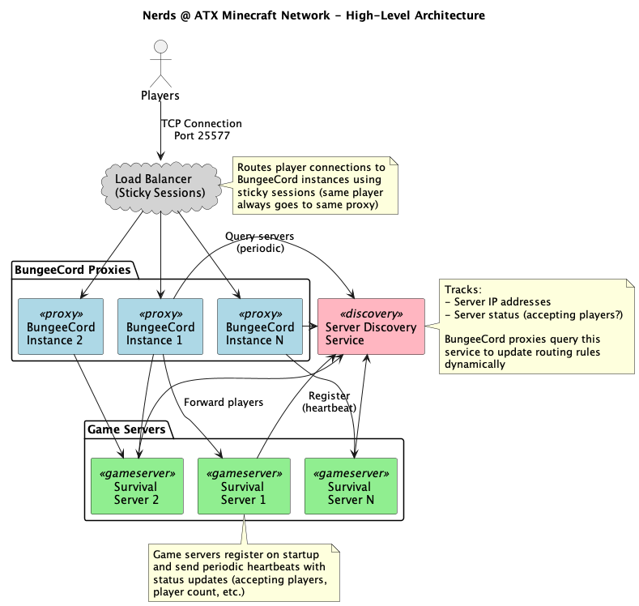

# Nerds @ ATX Minecraft Network

A Kotlin-based Minecraft server network with AWS ECS infrastructure management.

## Project Overview

This is a simple Minecraft network setup with:
- **SurvivalServer**: A vanilla survival Paper server
- **BungeeCordServer**: BungeeCord proxy server for network connectivity
- **Docker**: Local development environment
- **AWS ECS**: Production infrastructure deployed on AWS Fargate

## Project Structure

```
minecraft-network/
├── CLAUDE.md                   # Detailed project documentation
├── settings.gradle.kts         # Module definitions
├── build.gradle.kts            # Root build configuration
├── gradle/
│   └── libs.versions.toml      # Centralized dependency versions
├── SharedCore/                 # Shared utilities and models
│   ├── build.gradle.kts
│   └── src/main/kotlin/dev/nerdsatx/shared/
├── SurvivalPlugin/             # Survival server plugin
│   ├── build.gradle.kts
│   └── src/main/kotlin/dev/nerdsatx/survival/
├── BungeeCordServer/           # BungeeCord server plugin
│   ├── build.gradle.kts
│   ├── Dockerfile
│   └── src/main/kotlin/dev/nerdsatx/proxy/
├── SurvivalServer/             # Server files and configuration
│   ├── Dockerfile
│   └── server/
├── MinecraftCdk/               # AWS CDK infrastructure code
│   ├── build.gradle.kts
│   └── src/main/kotlin/dev/nerdsatx/cdk/
└── docker-compose.yml          # Local development infrastructure
```

## Quick Start

### Option 1: Local Development with Docker (Recommended)

```bash
# 1. Build the plugins
./gradlew build

# 2. Start the servers
docker-compose up -d

# 3. Connect in Minecraft to localhost:25577
```

See [DOCKER.md](DOCKER.md) for detailed Docker setup and usage.

### Option 2: Deploy to AWS

```bash
# Build plugins
./gradlew build

# Install AWS CDK (first time only)
npm install -g aws-cdk

# Configure AWS credentials
aws configure

# Deploy infrastructure
cd MinecraftCdk
cdk bootstrap  # first time only
cdk deploy
```

### Build Commands

```bash
# Build all plugins
./gradlew build

# Build specific plugin
./gradlew :SurvivalPlugin:shadowJar
./gradlew :BungeeCordServer:shadowJar
```

Output JARs:
- `SurvivalPlugin/build/libs/SurvivalPlugin.jar`
- `BungeeCordServer/build/libs/BungeeCordServer.jar`

## Technology Stack

- **Language**: Kotlin 1.9.22
- **Build Tool**: Gradle with Kotlin DSL
- **Minecraft Platform**: Paper API 1.20.4
- **Proxy**: BungeeCord
- **Infrastructure**: AWS CDK with ECS Fargate
- **Plugin Packaging**: Shadow plugin for fat JARs

## Module Dependencies

```
SurvivalPlugin   ──→  SharedCore
BungeeCordServer ──→  SharedCore
MinecraftCdk     (independent)
SurvivalServer   (independent)
```

## Common Commands

```bash
# Build entire project
./gradlew build

# Build specific plugin
./gradlew :SurvivalPlugin:shadowJar

# Clean and rebuild
./gradlew clean build

# Run tests
./gradlew test

# Deploy infrastructure
cd MinecraftCdk && cdk deploy
```

## Architecture



### AWS Infrastructure

The infrastructure deploys to AWS ECS Fargate with:

- **VPC**: Multi-AZ with public and private subnets
- **BungeeCord**: Public-facing proxy on port 25577
- **Survival Server**: Private subnet, accessed via BungeeCord
- **S3 Bucket**: For world backups and persistence
- **CloudWatch**: Logging and monitoring

Players connect to the BungeeCord proxy IP on port 25577, which routes them to the appropriate server.

## Development

See [CLAUDE.md](CLAUDE.md) for detailed development guidelines, patterns, and best practices.

## Next Steps

1. Test locally with Docker: `docker-compose up`
2. Customize plugin functionality in `SurvivalPlugin/`
3. Add custom BungeeCord commands in `BungeeCordServer/`
4. Configure server properties in `SurvivalServer/server/`
5. Deploy to AWS: `cd MinecraftCdk && cdk deploy`
6. Set up automated backups to S3
7. Add monitoring and alerting with CloudWatch

## Documentation

- [README.md](README.md) - This file, main project overview
- [DOCKER.md](DOCKER.md) - Detailed Docker setup and local development
- [CLAUDE.md](CLAUDE.md) - Development guidelines and patterns
- [MinecraftCdk/README.md](MinecraftCdk/README.md) - AWS infrastructure details
- [Documentation/diagrams/](Documentation/diagrams/) - Architecture diagrams

### Regenerating Diagrams

Architecture diagrams are generated from PlantUML source files in the `Documentation` module:

```bash
# Generate all diagrams
./gradlew :Documentation:build

# Output: Documentation/diagrams/architecture.png
```

PlantUML source files are located in `Documentation/src/main/plantuml/`.

## License

Private project for Nerds @ ATX
